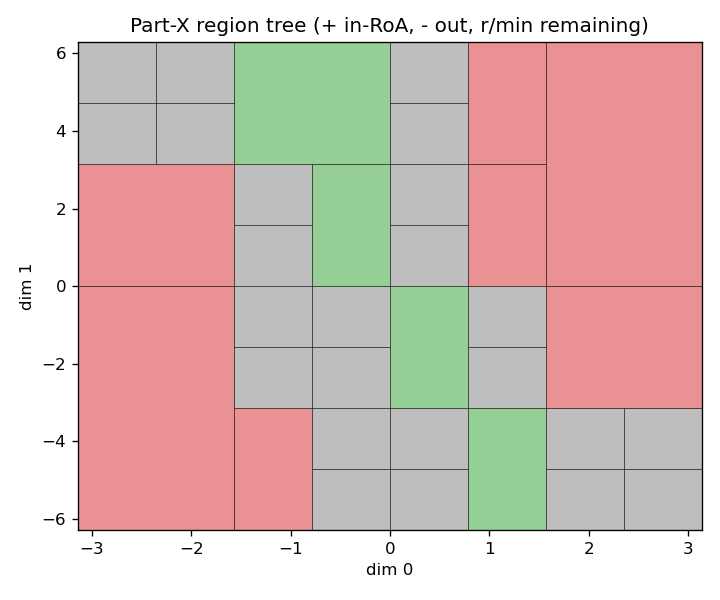

# Part-X pendulum: first real run

First non-smoke run of the Part-X GP + level-set BO pipeline on the real pendulum
`pendulum_lqr_50k` dataset. Composition mirrors `scripts/run_adaptive.py`
(`config_name="default"` plus Hydra group overrides — there is no
`configs/adaptive_v2/experiment/` group in this repo):

```
system=pendulum predictor=gp acquisition=partx eval=partx
n_epochs=6 samples_per_epoch=50 initial_train_size=100 device=cuda:0
predictor.gp.n_iters=300 acquisition.n_candidates=2000 acquisition.bounds.R=200
output_dir=outputs/partx_pendulum_dev
```

Run wall-time: ~73 s on one GPU (11 GB). All 6 epochs completed; each
`outputs/partx_pendulum_dev/epoch_00N/artifacts_v2.json` carries
`acquisition.diagnostics.roa_volume` + `roa_volume_ci` and a `d1_eval_metrics.coverage`.

## Per-epoch results

| epoch | roa_volume | 90% CI            | leaves (total / remaining) | test_coverage |
|:-----:|:----------:|:------------------|:--------------------------:|:-------------:|
|   0   |   0.3406   | [0.3203, 0.3598]  |          2 / 2             |    0.9200     |
|   1   |   0.3445   | [0.3320, 0.3477]  |          4 / 4             |    0.9714     |
|   2   |   0.4023   | [0.3944, 0.4082]  |          8 / 8             |    1.0000     |
|   3   |   0.3909   | [0.3867, 0.3975]  |         14 / 12            |    1.0000     |
|   4   |   0.3940   | [0.3901, 0.3975]  |         23 / 18            |    1.0000     |
|   5   |   0.3941   | [0.3875, 0.3950]  |         35 / 24            |    1.0000     |

## Region tree (final epoch)



Axes are the raw pendulum state: dim 0 = θ ∈ [−π, π], dim 1 = θ̇. Green =
`+` (classified in-RoA), red = `−` (out-of-RoA), gray = `r`/`min` (unresolved).
Final tree: 35 leaves (4 `+`, 7 `−`, 24 `r`).

## Sanity check

- **roa_volume stabilizes.** The estimate rises from ~0.34 (2-leaf tree, epoch 0)
  and settles to ~0.39–0.40 from epoch 2 onward, with the CI tightening from a
  width of ~0.04 to ~0.008 as the tree refines. The final ~0.394 matches the
  Task-14 e2e smoke range (≈0.35–0.39) and is a physically plausible fraction for
  the stable-down basin over this state box.
- **Remaining (`r`) leaves track the separatrix.** In-RoA (`+`) leaves cluster
  around θ ≈ 0 (the stable-down attractor at θ=0, θ̇=0); out-of-RoA (`−`) leaves
  sit at large |θ| (centers near ±0.75π and the ±0.375π shoulder). The unresolved
  `r` leaves occupy the intermediate θ band and, notably, the high-|θ̇| rows
  (θ̇ ≈ ±3.9, ±5.5) — i.e. the swing-up/energy boundary where the basin edge winds
  through phase space. So the unresolved mass concentrates along the basin
  boundary rather than in the clear interior/exterior, as intended.
- **Conformal coverage meets the guarantee.** With α = 0.1 (calibration config),
  the target is test_coverage ≥ 1−α = 0.9. Coverage is 0.92 at epoch 0 and 0.97
  at epoch 1, saturating at 1.0 for epochs 2–5. The guarantee holds every epoch.

## Honest notes / caveats

- Coverage pins at exactly **1.0** from epoch 2 on. This satisfies the ≥0.9
  guarantee but indicates the conformal sets are conservative (over-covering) on
  this pendulum test split once the GP has enough data — not a coverage failure,
  but worth watching if efficiency (small prediction sets) matters later.
- This was a deliberately modest budget (6 epochs, 50 samples/epoch, 2000
  candidates, R=200 for the volume MC). The volume CI is a MC/Bayesian estimate
  at fixed R; larger R would narrow it further. Numbers here are a qualitative
  first-run sanity artifact, not a converged/production estimate.
- The region tree only had 6 epochs of straddle refinement (35 leaves); a longer
  run would resolve more of the gray band into `+`/`−`.

Raw artifacts (git-ignored): `outputs/partx_pendulum_dev/epoch_00N/artifacts_v2.json`,
`final_tree_leaves.json`, `run_summary.json`, `run.log`.
